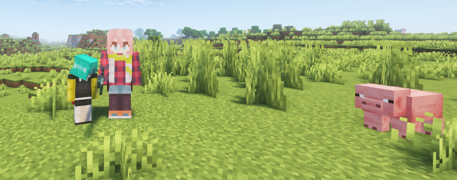

# Adorena - アドレナ

## Overview

Adorena is a lightweight, versatile plugin designed for Paper servers. It enhances PvP encounters by applying
special effects to players when they kill or are killed, making for more thrilling combats, entertaining minigames,
and dynamic survival experiences.




---

## Downloads

### Coming soon to Hangar


___

## Configuration

The plugin works by modifying player attributes and increasing or decreasing their intensity.
Many aspects of the plugin are configurable, such as the set of attributes, the applied effect's magnitude, etc.

```yaml
# scale to grow/shrink by (0.025 = 2.5%)
growth-rate: 0.025

effect-on-kill:
  # grow | shrink | none
  effect: grow

  # number of times the effect can be applied at most
  maximum-times: 20

  # whether the effect should be removed entirely on death in PvP/PvE
  reset-on-pvp-death: false
  reset-on-pve-death: false

  # whether the effects apply when killing a monster as well
  apply-upon-killing-monsters: false

  # ticks until the effect can be applied again
  cooldown-ticks: 100

effect-on-death:
  effect: shrink
  maximum-times: 20
  cooldown-ticks: 100
  apply-upon-dying-to-monsters: false

clear-effect-with-milk: true

suspicious-stew-applies-effects-randomly: false

# whether the effect applies to monsters when they kill an entity
# can be: always | player-kills-only | never
applies-to-monsters: never

# when the death/kill effect is applied, the following attributes are scaled by growth-rate.
# this other setting allows for fine-tuning each attribute on top of growth-rate (combined, multiplied),
# so growth-rate serves as a global scale.
# while the idea of the plugin revolves around the scale attribute, attributes can be added or removed as needed/wanted
attribute-scale-multipliers:
  minecraft:scale: 1.0
  minecraft:safe_fall_distance: 1.0
  minecraft:step_height: 1.0
  minecraft:jump_strength: 1.0
  minecraft:block_interaction_range: 1.0
  minecraft:entity_interaction_range: 1.0
```

---

## Commands

- `/adorena reload` - Reloads the configuration.
- `/adorena reset [<targets>]` - Resets the modified attributes of the target entities to their default values.
- `/adorena amplitude get [<target>]` - Prints you the active amplitude of plugin effects of the target.
- `/adorena amplitude set [<targets>]` - Applies effects with the given amplitude to the provided targets.

## Permissions

- `adorena` - Required to use any `/adorena` command.
- `adorena.reload` - Grants access to the `/adorena reload` command.
- `adorena.reset` - Grants access to the `/adorena reset` command.
- `adorena.amplitude` - Required to use `/adorena amplitude` commands.
- `adorena.amplitude.get` - Grants access to the `/adorena amplitude get` command
  for querying your own effects amplitude.
- `adorena.amplitude.get.others` - Grants access to the `/adorena amplitude get <target>` command
  for querying others' effects amplitude.
- `adorena.amplitude.set` - Grants access to the `/adorena amplitude set` command
  to alter your own effects amplitude.
- `adorena.amplitude.set.others` - Grants access to the `/adorena amplitude set <targets>` command
  to alter others' effects amplitude.

---

## Support

For issues, suggestions, or contributions, join our [Discord](https://discord.gg/yBMGfsZKQE).

---

## License

This plugin is open-source and licensed under the GNU GPL v3.
